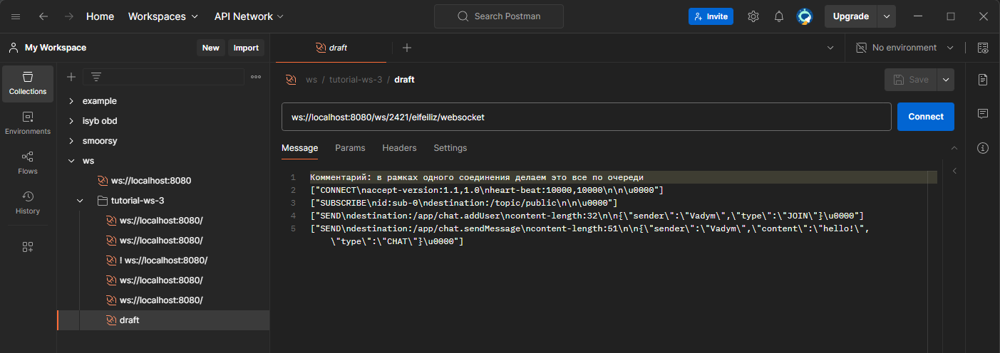

Почему-то коллекцию для ws не удается экспортировать

Комментарий: в рамках одного соединения делаем это все по очереди
```
ws://localhost:8080/ws/2421/eifeiliz/websocket

["CONNECT\naccept-version:1.1,1.0\nheart-beat:10000,10000\n\n\u0000"]
["SUBSCRIBE\nid:sub-0\ndestination:/topic/public\n\n\u0000"]
["SEND\ndestination:/app/chat.addUser\ncontent-length:32\n\n{\"sender\":\"Vadym\",\"type\":\"JOIN\"}\u0000"]
["SEND\ndestination:/app/chat.sendMessage\ncontent-length:51\n\n{\"sender\":\"Vadym\",\"content\":\"hello!\",\"type\":\"CHAT\"}\u0000"]
```